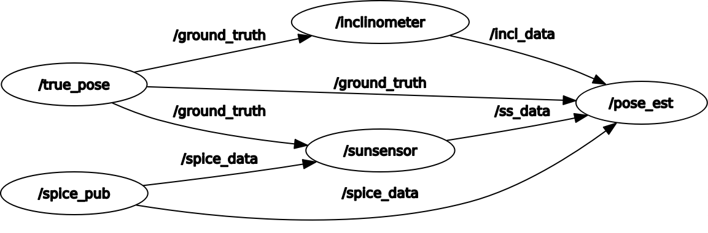

## Sun Sensor Heading Determination
---
This project uses sun sensor and accelerometer data to determine the heading of the rover. It interfaces with the cspice package, included in the position_estimator directory, used to calculate the sun vector
---
# Content
The important directories of the package are:
1. launch: this includes two files
	- test.launch: this runs all nodes required to simulate the heading
	- world.launch: this runs the gazebo example for setting the sun direction in the siumulation
2. msg: this has 3 messages
	- angles: this is for the sun sensor measurement angles - it has 2 alphas, betas, and errs
	- eulAng: this is to describe pose - it has 3 euler angles
	- s_vec: this is just a vector we use to send sun vectors
3. spice_kernels: this includes all the spice data found [here](https://naif.jpl.nasa.gov/pub/naif/generic_kernels/). It might be neccissary to change the kernels depending on the timeframe of interest
	- metakernel: metakernel to furnish the kernels needed for calculations on the moon
	- metakernelEarth: same thing, but for use on the earth
4. src: all the code for the nodes - this is the way they interact in teh simulated case: )
	- poseEstimation: this estimates the heading and compares it to the true pose
	- spicy: this is the ephemeris node - it interfaces with cspice to calculate the sun vector at a certain time at a certain location
	- spicyEarth: same as spicy, but for testing earth
	- truePose: simulates the true orientation of the rover
	- inclinomer: uses the truePose to simulate inclinometer measurements
	- ss: uses truePose and spicy to simulate sun sensor measurements
	- sunPlugin: gazebo plugin to change the sun direction according to a sun vector determined by spicy/spicyEarth
5. worlds: This has one gazebo world
	- contain_example.world: this is used for sunPlugin
